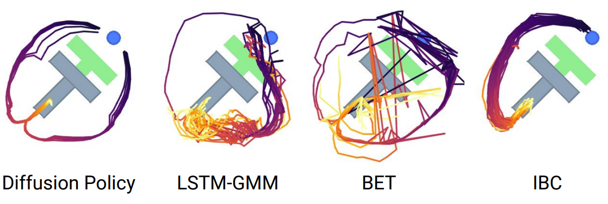

# Diffusion Reinforcement Learning

## What is diffusion? [$_1$](https://arxiv.org/abs/2105.05233)

We define the target distribution as a chain of denoising processes:

$$
  p_\theta(x_0) = \Pi_{t=1}^T p_\theta(x_{t-1} | x_t)
$$
where $p$ is the distribution of the data point, $x_0$ is the data point itself.

The forward process is defined as a process of continually noising the original datapoint:

$$
  q(x_T) = \Pi_{t=1}^T q(x_t | x_{t-1})
$$
where $q$ is the noising process

**Why does this matter?**

- Because you're not constrained by distributions that limit representation power:
  - VAE, VQVAE
- Autoregressive in manifold space, not output space.

**How does this compare to other generative models? [Lilian Weng](https://lilianweng.github.io/posts/2021-07-11-diffusion-models/)**

---

### Some Math

**Forward diffusion** (noising) process is formally defined as:

$$
  q(x | x_{t-1}) = \mathcal{N} (\sqrt{1 - \beta_t} x_{t-1}, \beta_t I)
$$
ie: scale down original image, add noise.

**Reverse diffusion** process is formally defined as:

$$
  p_\theta (x_{t-1} | x_t) = \mathcal{N} (\mu_\theta (x_t, t), \Sigma_\theta (x_t, t))
$$
where the mean predictor is a predictor for just the noise:
$$
  \mu_\theta (x_t, t) = \frac{1}{\alpha_t} \left(
    x_t - \frac{\beta_t}{\sqrt{1 - \alpha_i}} \epsilon_\theta(x_t, t) 
  \right)
$$
ie: we predict the noise scaled and offset by some scheduler.

**The optimization objective** is to generally optimize the ELBO:
$$
  \mathbb{E}_q \left[ 
    log \frac{p_\theta (x_{0:T})}{q_T}
p_\theta (x_{0:T}
) 
  \right]
$$
Which just boils down to:
$$
  \mathcal{L} = \mathbb{E}_{t \sim \mathcal{U}, \epsilon \sim \mathcal{N}(0, I), (x_0) \sim \mathcal{D}}
    \left[ 
      || \epsilon - \epsilon_\theta (\sqrt\alpha_t x_t + \sqrt{1 - \alpha_t} \epsilon, x_t, t) || ^ 2
    \right]
$$
ie: sample data, apply random noise schedule, predict noise.

**During sampling**, we first sample $x_T \sim \mathcal{N} (0, I)$, then do:
$$
  x_{t-1} | x_t = \frac{x_t}{\sqrt{\alpha_t}} - \frac{\beta_t}{\sqrt{\alpha_t (1 - \alpha_t)}} \epsilon_\theta (x_t, t) + \sqrt{\beta_t} \epsilon\\
$$
where $\epsilon \sim \mathcal{N}(0, I)$ at every step.
There are various methods of scheduling $\beta_t$.

---

### Extension to Conditional Diffusion

Conditional diffusion is just diffusion, but instead of passing only $t$ to the denoising model, we also pass in a context vector.

---
---
---

## Diffusion Policies - Diffusion for Behaviour Cloning [$_1$](https://arxiv.org/pdf/2303.04137v4)

### Why is BC hard?

- Multimodal action distributions
- Distribution shift in low data regimes
- Idle actions - during the start of demonstrations, there may be timesteps where no actions are taken. 1 step BC tends to overfit to this and careful clipping of trajectories must happen.

### How does it work?

- Predict a sequence of actions, $x_t = (a_0, a_1, a_2, ..., a_n)$.
  - Paper uses $n = 16$.
- Condition on visual observation.
  - Paper uses embedding vector from ResNet19, 76x76 image or 288x216 image.
- Use transformer to condition on history.
  - Paper uses observation horizon = 2, action horizon = 8.
 
### What are the benefits?

- High dimension output space - we can now predict actions for many steps into the future

- Explainability - we can see what the policy is about to do
- Stable training - not sure if this is a perk because behaviour cloning already uses static distributions
- Can use direct position control - leverage the power of low level optimal control for robot positioning and RL for high level control

### Experiments

- Franka Kitchen, 566 demonstrations across 4 tasks
- Sauce pouring, 50 demonstrations

### Results

### Limitations

Offline RL > BC

---
---
---

## Classifier Guided Diffusion [$_1$](https://arxiv.org/abs/2105.05233)

What if we wanted to guide diffusion toward particular distributions within the training data during inference?
This would work to a limited extent for conditional diffusion, but won't give _complete flexibility_.

Assuming we have a classifier model that can give us gradients (such as CLIP), we can perform **classifier guided diffusion** instead.
Essentially, we modify the sampling step to be:

$$
  x_{t-1} = denoise(x_t) + \lambda \nabla_{x_i} \log f_\phi (c | x_t) 
$$
where $f_\phi$ is a categorial classifier and $c$ is the class category.
Ie: we use the gradients of the classification model to nudge the diffusion process.

### Advantages

- Class Control
- High quality samples

### Disadvantages

- Expensive to compute - one full backward pass per step
- Less creativity

## Classifier Free Diffusion [$_1$](https://arxiv.org/abs/2207.12598)

All big and popular image generation models use this.
Basically, we condition the diffusion model on an embedding vector (usually obtained from CLIP), and then alternate between with-embedding and without-embedding steps:

$$

$$

