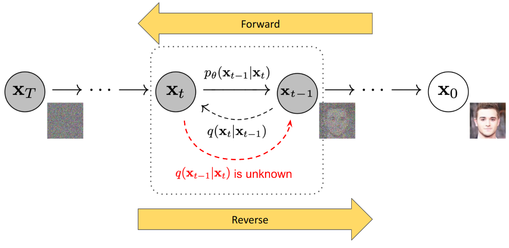
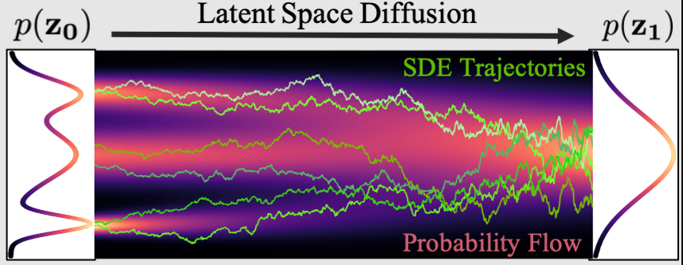

# Diffusion RL

---

## Agenda

1. What is Diffusion?
2. Diffusion Policy (Behaviour Cloning)
3. Classifier Guided Diffusion
4. Diffusion Offline RL
5. Diffusion Online RL

---

## What is Diffusion?

A technique for modelling complex multidimensional distributions.

- Forward diffusion (noising)
$$
  q(x_T) = \Pi_{t=1}^T q(x_t | x_{t-1})
$$
- Reverse diffusion (denoising)
$$
  p_\theta(x_0) = \Pi_{t=1}^T p_\theta(x_{t-1} | x_t)
$$

---

### Intuition

- No mode collapse.
- No naive distributions.
- Theoretically infinite modes.

---

{style="display: block; margin: 0 auto;"}

---

