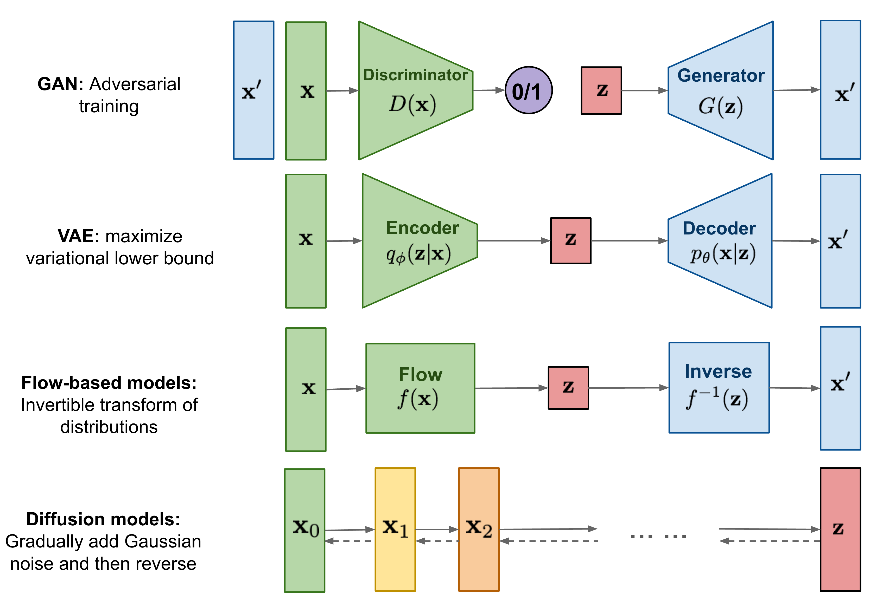
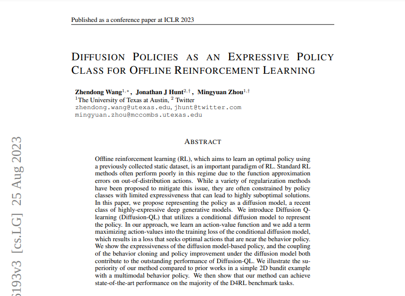

# Diffusion RL

---

## Agenda

1. What is Diffusion?
2. Diffusion Policy (Behaviour Cloning)
3. Classifier Guided Diffusion
4. Diffusion Offline RL
5. Diffusion Online RL

---

# What is Diffusion?

A technique for modelling complex multidimensional distributions.

- Forward diffusion (noising)
$$
  q(x_T) = \Pi_{t=1}^T q(x_t | x_{t-1})
$$
- Reverse diffusion (denoising)
$$
  p_\theta(x_0) = \Pi_{t=1}^T p_\theta(x_{t-1} | x_t)
$$

---

### Intuition

- No mode collapse.
- No naive distributions.
- Theoretically infinite modes.

---

### Intuition

---

### Implementation 

Forward diffusion (noising)
$$
  q(x_t | x_{t-1}) = \mathcal{N} (\sqrt{\alpha_t} x_{t-1}, (1 - \alpha_t) I)
$$
Can be generalized to
$$
  q(x_t | x_0) = \mathcal{N} (\sqrt{\bar{\alpha}_t} x_0, \sqrt{1 - \bar{\alpha}_t} I)
$$

Reverse diffusion (denoising)
$$
  p_\theta (x_{t-1} | x_t) = \mathcal{N} (\mu(x_t, t), \sigma (x_t, t))
$$

---

# Diffusion Policies (Behaviour Cloning)

Diffusion for n-step action prediction

---

## 

---

