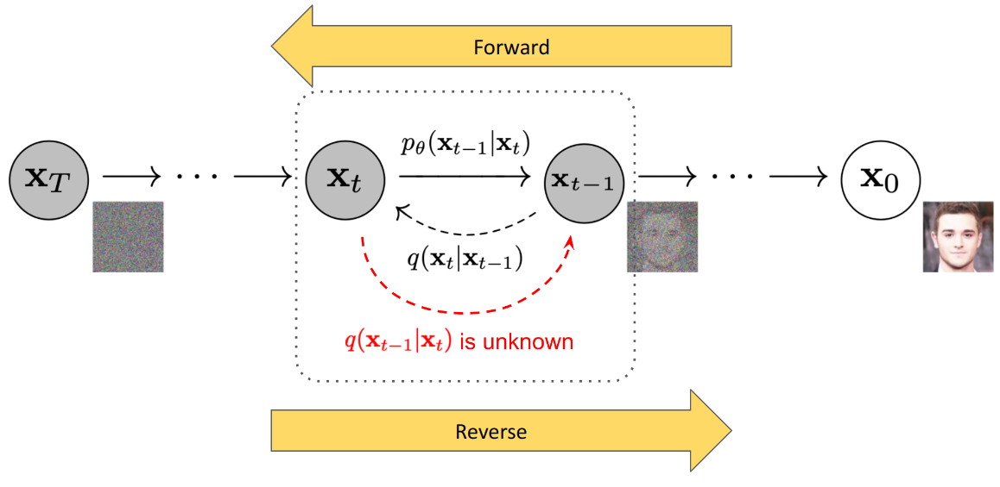
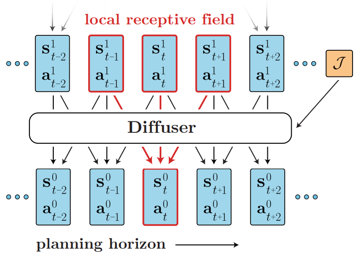

# Diffusion RL

> 24 Oct 2024

---

## Agenda

1. What is Diffusion?
2. Diffusion Policies (Behaviour Cloning)
3. Diffusion for Offline RL

---

# What is Diffusion?

A technique for modelling complex multidimensional distributions.

- Forward diffusion (noising)
$$
  q(x_T) = \Pi_{t=1}^T q(x_t | x_{t-1})
$$
- Reverse diffusion (denoising)
$$
  p_\theta(x_0) = \Pi_{t=1}^T p_\theta(x_{t-1} | x_t)
$$

---

### Intuition

- No mode collapse.
- No naive distributions.
- Theoretically infinite modes.

---

### Implementation

Forward diffusion (noising)
$$
  q(x_t | x_{t-1}) = \mathcal{N} (\sqrt{\alpha_t} x_{t-1}, (1 - \alpha_t) I)
$$
Can be generalized to
$$
  q(x_t | x_0) = \mathcal{N} (\sqrt{\bar{\alpha}_t} x_0, \sqrt{1 - \bar{\alpha}_t} I)
$$

Reverse diffusion (denoising)
$$
  p_\theta (x_{t-1} | x_t) = \mathcal{N} (x_t - \epsilon(x_t, t), \sigma (x_t, t))
$$

---

# Diffusion Policies (Behaviour Cloning)

Diffusion for n-step action prediction

---

## Goal

- Pure behaviour cloning
- <200 demonstrations per task

---

## Approach

Let $\mathbf{A}_t = \mathbf{a}_{t, ... t+H}$, $\mathbf{O}_t = \mathbf{o}_{t, ... t+H}$, then

$$
  \pi(\mathbf{A}_t | \mathbf{O}_t) = \Pi_{k=1}^K p_\theta(\mathbf{A}_t^{n-1} | \mathbf{A}_t^n, \mathbf{O}_t)
$$

Where:

- superscript = Diffusion time
  - $k$: Diffusion timestep
  - $K$: Diffusion total steps
- subscript = RL time
  - $t$: RL timestep
  - $H$: Receding horizon length

---

## Implementation Details

---

## Implementation Details - CNN

- _Similar_ to **Planning with Diffusion for Flexible Behavior Synthesis**
- 1D Temporal CNN
- Easier to train
- Not robust to fast action changes

---

## Implementation Details - Transformer

- Pure Cross Attention Model
- Q = $\mathbf{A}_t$
- K = V = $f_{\phi_1}(\mathbf{O}_t), f_{\phi_2}(\mathbf{A}_t)$
- Tricker to train

---

## Experiments

Environments:
- Robomimic
- Push-T
- Block Pushing
- Franka Kitchen
- *Real world*

---

## Experiments

Baselines:
- LSTM Gaussian Mixture Model (LSTM-GMM)
  - Direct regression with mixture model
- Implicit Behaviour Cloning (IBC)
  - Behaviour cloning with VAE latent space
- Behaviour Transformer (BET)
  - Classification to binned actions w/ transformer

---

---

---

---

## Results

- Position Action Space > Velocity Action Space
- Don't have to truncate idle actions
- Temporal action consistency

---

# Extension to Offline Reinforcement Learning

Bootstrapping from offline data to perform better than offline data

---

## Approach

In a normal diffusion denoising, we follow gradient of log prob:

$$
  \mathbf{A}_{t-1} = a_t + \eta \nabla_{\mathbf{A}_t} \log p_\mathcal{D}(\mathbf{A}_t) + \epsilon
$$

In RL, we want to additionally follow gradient of Q value:

$$
  \mathbf{A}_{t-1} = a_t + \eta_1 \nabla_{\mathbf{A}_t} \log p_\mathcal{D}(\mathbf{A}_t) + \eta_2 \nabla_{\mathbf{A}_t} Q(\mathbf{O}_t, \mathbf{A}_t) + \epsilon
$$

To do that, we use this update rule:

$$
  \mathcal{L}_{\pi_\theta} = \mathcal{L}_{d} - \alpha \cdot \mathbb{E}_{\mathbf{s} \sim \mathcal{D}, \mathbf{A}_t \sim \pi_\theta} [Q_\phi (\mathbf{O}_t, \mathbf{A}_t)]
$$

This requires differentiating through diffusion chain.

---

## Implementation

- 3-layer MLP policy, 256 units
- $\alpha = \frac{\eta}{\mathbb{E}_{(s, a)} \sim \mathcal{D} [| Q_\phi (\mathbf{O}, \mathbf{A}) |]}$
- $H = 1$

---

---

## Results

---

## Diffusion-QL without differentiating through chain

---

## Approach

EDP steps only once w/ very large step size.

Noising step:

$$
  \mathbf{A}_t^n = \sqrt{\bar{\alpha}^n} \mathbf{A}_t^0 + \sqrt{1 - \bar{\alpha}^n} \cdot \epsilon
$$

Sampling step:

$$
  \hat{\mathbf{A}}_t^0 = \frac{1}{\sqrt{\bar{\alpha}^n}} \mathbf{A}_t^n - \frac{\sqrt{1 - \bar{\alpha}^n}}{\sqrt{\bar{\alpha}^n}} \epsilon_\theta(\mathbf{A}_t^n, \mathbf{O}_t, n)
$$

---

## Results

---